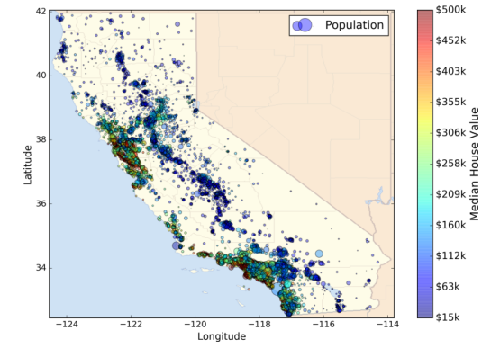

# **2. 端对端机器学习项目**

本章将完整地介绍一个端对端（End-to-End）机器学习项目。假如你是某个房地产公司刚雇佣的数据科学家，你所要做的事情主要分成以下几个步骤：

1.整体规划。

2.获取数据。

3.发现、可视化数据，增加直观印象。

4.为机器学习准备数据。

5.选择模型并进行训练。

6.调试模型。

7.给出解决方案。

8.部署、监控、维护系统

## **2.1 使用真实数据**

学习机器学习时，最好使用真实数据，而不是“人造”数据。幸运的是，有许多开源的数据集可以免费使用，涉及许多行业领域。下面列举一些：

- 知名的开源数据仓库：

    — [UC Irvine Machine Learning Repository](http://archive.ics.uci.edu/ml/)

    — [Kaggle datasets](https://www.kaggle.com/datasets)

    — [Amazon’s AWS datasets](http://aws.amazon.com/fr/datasets/)

- 综合门户网站：

    — [http://dataportals.org/](http://dataportals.org/)

    — [http://opendatamonitor.eu/](http://opendatamonitor.eu/)

    — [http://quandl.com/](http://quandl.com/)

- 其它：

    — [Wikipedia’s list of Machine Learning datasets](https://goo.gl/SJHN2k)

    — [ Quora.com question](http://goo.gl/zDR78y)

    — [ Datasets subreddit](https://www.reddit.com/r/datasets)

这一章我们将使用来自 StatLib 仓库的 California 房屋价格数据集（如下图所示）。这份数据集来自 1990 年的普查统计。这份数据集虽然年代有点久了，但不妨碍我们使用。我们已经对该数据集进行了一些处理，便于学习。

## **2.2 整体规划**

欢迎来到机器学习房地产公司！你的第一个任务就是根据 California 普查数据来建立一个房价预测模型。这份普查数据包含了 California 每个地区的人口、收入中位数、房价中位数等信息，每个地区人口大约 600 到 3,000 人。

你的模型应该对这些数据进行学习，然后根据提供的其它信息，预测任意地区的房价中位数。

### **2.2.1 划定问题**

首先第一个问题就是问你的老板商业目标是什么，构建一个模型可能不是最终的目标。公司期望如何使用这个模型并从中获利？这很重要，因为它决定了你如何划定问题，选择什么算法，使用什么性能测量方式来评估模型，以及在调试模型上花费多大的力气。

你的老板回答说你的模型输出（预测地区房价中位数）将连同许多其它信号传输到另外一个机器学习系统（如下图所示）。这个下游系统将决定是否对该地区投资房地产。得到正确的预测非常重要，因为它直接影响到收益。

**管道（pipeline）**

数据处理组件的序列叫做数据管道（pipeline）。管道在机器学习系统中很常见，因为有许多数据要处理和转换。

管道的各个组件是异步进行的。每个组件都会输入大量数据并处理，然后将结果传输给管道的下一个组件，下一个组件继续处理并输出结果，依次进行。每个组件相对独立，组件之间的接口就是简单的数据存储。这让系统更加简单且容易掌控（借助数据流程图），不同的团队可以专注于各自的组件。而且，即便是某个组件崩溃了，下游组件仍然能使用之前上游输出的数据进行正常工作（至少在一段时间内）。这让整个系统更加健壮。

然而从另一方面来说，如果不能及时发现崩溃的组件，下游组件输入数据得不到及时更新，整个系统的性能也会下降。

下一个问题就是询问当前是如何预测房价的，作为你的模型的性能参考。你的老板回答说当前房价是由专家们进行人工预测的，方法是收集各个地区大量最新信息（除了房价），然后使用复杂的规则进行估计。这种做法成本高、费时间，而且正确率也不高，错误率达到了 15%。

好了，设计系统需要的所有信息已经准备好了。首先，你需要划定问题：这是监督式，非监督式，还是增强学习？这是分类任务，回归任务，还是其它任务？应该使用批量学习还是在线学习技术？在真正开始之前请先回答这些问题。

回答出来了吗？我们一起来看一下：这是一个典型的监督式学习任务，因为训练样本的标签是已知的（每个实例都有它的期望输出，例如各地区的房价中位数）。这也是典型的回归问题，因为我们的目标是预测房价。这也是多元回归问题，因为系统将使用多个特征进行预测（例如地区人课、收入中位数等）。在第一章预测居民幸福指数时，只有一个特征，人均 GDP，是一个单变量回归问题。最后，因为没有连续的数据流输入到系统，数据更新不是很频繁，而且数据量较小，所占内存不大，因此采用批量学习即可。

如果数据量很大，可以把整个数据集划分到不同的服务器上进行训练（使用 MapReduce 技术，后面将会讲到），或者你也可以使用在线学习技术。

### **2.2.2 性能指标**

下一步就要选择评估模型的性能指标。回归问题典型的性能指标是均方根误差（Root Mean Square Error, RMSE），即测量系统预测误差的标准差。例如，RMSE = 50,000 意味着有大约 68% 的预测值与真实值误差在 $50,000 之内，大约有 95% 的预测值与真实值误差在 $100,000 之内。计算 RMSE 的公式如下：

$$RMSE(X,h)=\sqrt{\frac1m\sum_{i=1}^m(h(x^{(i)})-y^{(i)})^2}$$

**符号**

这个公式引入了一些常见的机器学习符号：

- $m$ 表示样本个数，如果有 2,000 个样本实例，则 $m=2000$。

- $x^{(i)}$ 表示第 $i$ 个样本的所有特征值，$y^{(i)}$ 表示第 $i$ 个样本的标签（真实值）。例如第 1 个地区，经度 -118.29°，维度 33.91°，人口 1416，收入中位数 $ 28372，实际房价中位数为 $156400。则有：

$$
x^{(1)}=
\left[
\begin{matrix}
    -118.29 \\
    33.91 \\
    1416 \\
    28372
\end{matrix}
\right]
$$

$$y^{(1)}=156400$$

- $X$ 是包含所有样本特征值的矩阵（除了样本标签）。每一行是一个实例，第 $i$ 行是 $x^{(i)}$ 的转置，记为 $(x^{(i)})^T$。如下所示：

$$
X=
\left[
\begin{matrix}
    (x^{(1)})^T \\
    (x^{(2)})^T \\
    \cdots \\
    (x^{(1999)})^T \\
    (x^{(2000)})^T
\end{matrix}
\right]
=
\left[
\begin{matrix}
    -118.29&33.91&1416&28372 \\
    \vdots&\vdots&\vdots&\vdots
\end{matrix}
\right]
$$

- $h$ 是系统预测函数，也称为假设（hypothesis）。当给出一个实例的特征向量 $x^{(i)}$ 时，系统预测输出为 $\hat y=h(x^{(i)})$。例如第一个地区的预测房价为 158400，即 $\hat y^{(1)}=158400$，则预测误差为：$\hat y^{(1)}-y^{(1)}=2000$。

- $RMSE(X,h)$ 是损失函数。

除了 RMSE 之外，还有其它性能指标。例如出现某些离群点，这种情况下可以使用平均绝对误差（Mean Absolute Error, MAE）作为性能指标。公式如下：

$$MAE(X,h)=\frac1m\sum_{i=1}^m|h(x^{(i)})-y^{(i)}|$$

RMSE 和 MAE 都是用来测量两个向量 $h(x^{(i)})$ 和 $y^{(i)}$ 之间的距离，或称为范数。常见的范数包括：

- $l_2$ 范数，如 RMSE，计算的是两个向量的欧式距离，记为 $∥\cdot∥_2$ 或 $∥\cdot∥$。

- $l_1$ 范数，如 MAE，计算的是两个向量的曼哈顿距离，记为 $∥\cdot∥_1$。

- 其它范数 $l_k$。对于 $n$ 维向量 $v$，它的 $l_k$ 范数为： $∥v∥_k=(|v_0|^k+|v_1|^k+\cdots+|v_n|^k)^{\frac1k}$。$l_0$ 为汉明范数，计算的是向量的基数（即向量包含的元素个数），$l_{\infty}$ 是切比雪夫范数，表示的是向量中最大的绝对值。

- 范数指数越大，就越重视绝对值大的值，忽视绝对值小的值。这就是为什么 RMSE 比 MAE 对离群点更加敏感。但是，如果离群点是呈指数减小的（类似正态分布曲线），RMSE 通常也会表现得不错。

### **2.2.3 检查假设**

最后，最好列出目前为止做得所有假设并验证，这能帮助你尽早发现问题。例如你预测房价，然后传输到下游机器学习系统。但是，下游机器学习系统实际上把你预测得价格转换成了不同类别（例如便宜、中等、昂贵），使用这些类别代替实际预测值。这种情况下，准确预测房价并不是特别重要了！你只需要对房价进行类别划分即可。这样的话，这就是一个分类问题而不是回归问题。这是需要提前弄清楚的，你可不想建立回归模型之后才发现事实。

幸运的是，在与下游机器学习系统沟通之后，确认这确实是一个回归问题。好了，接下来就开始真正地编写程序了。

